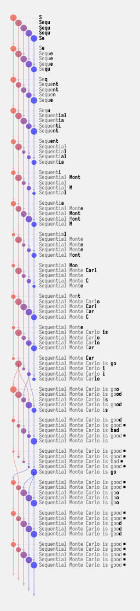

GenParse provides methods to visualize inference runs.

1. Specify `return_record=True` when calling `InferenceSetup`:
   
```python
result = setup(' ', n_particles=10, return_record=True)
```

2. Save the Sequential Monte Carlo (SMC) record of your inference run to a file by adding this to your source code:
   
```python
import json

# Save the SMC record to a file after the inference run.
with open('record.json', 'w') as f:
      f.write(json.dumps(result.record))
```

> **💡 Tip:** You can name the file anything you like. When you run the server you will be able to navigate to the file you choose. To see an example of this code in action see the [genparse_tiny_example.py](https://github.com/probcomp/genparse/blob/main/genparse_tiny_example.py).

3. Run the visualization server in `notes/smc_viz/`:
   
```bash
python -m http.server --directory notes/smc_viz 8000
```

4. Navigate to [localhost:8000/](http://localhost:8000/).

5. Select the JSON file created in step #2, then hit the Load button. 

> **💡 Tip:** The visualization may not appear on the screen because it is either too small or off screen. You can zoom in and out by pulling and pinching on your track pad and can scroll the visualization by dragging with your mouse.

The visualization will display the SMC steps, the particles at each step, and the weights of the particles. The bubbles on the left represent the weight of the particle. When particles are pruned you can see arrows splitting the continued particles to fill in the gaps.

